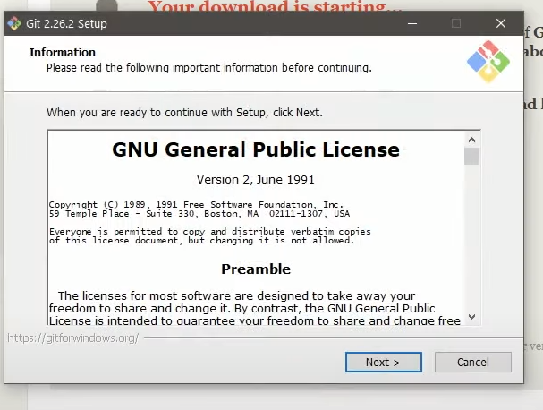
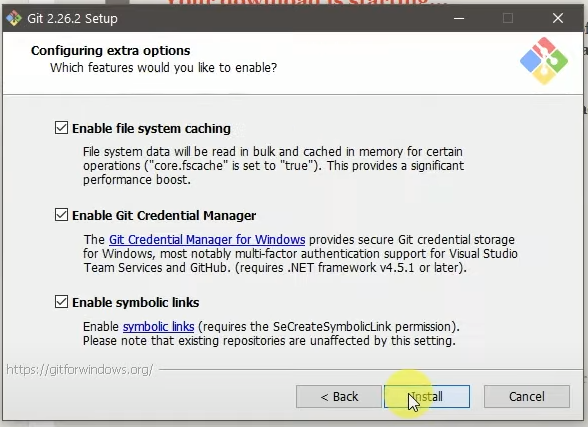
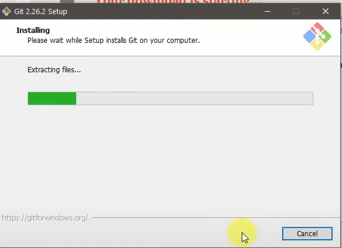
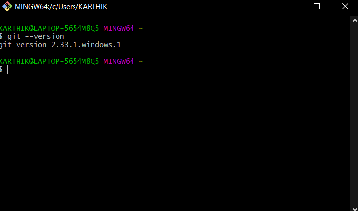

# Git installation

**GIT INSTALLATION**

### On Windows <a href="#_9474vx94v944" id="_9474vx94v944"></a>

* The first step is to visit this site and click the download button for the Windows version.

[Git installation Windows](https://git-scm.com/downloads)


* Please note(If you already have Git installed, you can get the latest development version via Git itself:

git clone [https://github.com/git/git](https://github.com/git/git))

* Now as it gets downloaded,click the file


* The System will prompt the user for installing the software.You can give “Yes” for installing it.
* After opening the file that is downloaded, a window will be shown as below



* You can click next.There’s no required changes.You can keep as it is.
* After going through many next, you could see the final window.Please click on the install button to install it.



* Please wait while it’s installing



* You can click “Next” or you could check the git bash so that it will launch here itself.But if you are clicking next


* Go through the software search in your system and search git.You could see git bash.Please click on it.


* Type “ git –version” (Note that there is double hyphen –)to know the git version you have installed.If the command is working,it means you have successfully installed git.



* **Hurray!!!!!** You have successfully installed git.

### On MACs <a href="#_ywx0wc6bwkvi" id="_ywx0wc6bwkvi"></a>

* The tool is most probably be installed in most MACs.To verify it, let us open the terminal.We can go to the window where we search for applications
* Type –git version to checkout the version
* If it shows, it means the installation has no faults.
* Else if there is any error, you can checkout this [Git installation MAC](https://www.atlassian.com/git/tutorials/install-git#mac-os-x) .

### On Linux <a href="#_d3r83o1zz4ex" id="_d3r83o1zz4ex"></a>

* Git is most probably inbuilt in most of the systems.
* Type git –version to check whether it's installed or not.


* Else check out the document [Git installation Linux](https://www.atlassian.com/git/tutorials/install-git#linux)

### GIT CONFIGURATION <a href="#_b47xtf3z0ins" id="_b47xtf3z0ins"></a>

Git configuration works the same across Windows, macOS, and Linux.Else If you haven’t configured your username for commits,you can execute the following commands.

#### **To set your global username/email configuration:** <a href="#_o53nmwn0sa3a" id="_o53nmwn0sa3a"></a>

* Open the command line/git bash/any terminal.
* Set your username:
  * git config --global user.name "Name"
* Set your email address:
  * git config --global user.email "[MY\_NAME@example.com](mailto:MY\_NAME@example.com)"
* Type your name and email address in the above string part.
* Verify your configuration by displaying your configuration file:\
  Git config –list
*

    <figure><figcaption></figcaption></figure>

#### **To set repository-specific username/email configuration:** <a href="#_i9n74043k4vy" id="_i9n74043k4vy"></a>

1. From the command line, change into the repository directory.
2. Set your username:\
   git config user.name "FIRST\_NAME LAST\_NAME"
3. Set your email address:\
   git config user.email "MY\_NAME@example.com"
4. Verify your configuration by displaying your configuration file:\
   git config –list

### TO CREATE A GITHUB ACCOUNT <a href="#_z3tear2x9zz1" id="_z3tear2x9zz1"></a>

If you don't already have a GitHub account, here's how to create one.

1. Open [https://github.com](https://github.com/) in a web browser, and then select Sign up.


.

2.Enter your email address.


3.Create a password for your new GitHub account, and Enter a username, too. Next, choose whether you want to receive updates and announcements via email, and then select Continue.


4.Verify your account by solving a puzzle. Select the Start Puzzle button to do so, and then follow the prompts.

5.After you verify your account, select the Create account button.

6.Next, GitHub sends a launch code to your email address. Type that launch code in the Enter code dialog, and then press Enter.


7.GitHub asks you some questions to help tailor your experience. Choose the answers that apply to you in the following dialogs:

How many team members will be working with you?

What specific features are you interested in using?

On the Where teams collaborate and ship screen, you can choose whether you want to use the Free account or the Team account. To choose the Free account, select the Skip personalization button.

GitHub opens a personalized page in your browser.


Congratulations! You've successfully created your GitHub account.

## SSH Keys

An SSH key is an access credential for the SSH (secure shell) network protocol. This authenticated and encrypted secure network protocol is used for remote communication between machines on an [unsecured open network](https://whatismyipaddress.com/unsecured-network). SSH is used for remote file transfer, network management, and remote operating system access. The SSH acronym is also used to describe a set of tools used to interact with the SSH protocol.

SSH uses a pair of keys to initiate a secure handshake between remote parties. The key pair contains a public and private key.&#x20;

## How to create SSH Keys?

Generate ssh file. Type the command in gitbash.

```bash
ssh-keygen -o
```

* It will generate a .ssh file in C/Users/\<your respective folder name>/.ssh.
* When asked to enter a passphrase, just type the enter key.
* When asked to enter the same passphrase again, type enter key.

<figure><figcaption></figcaption></figure>

Get into the ssh file&#x20;

```bash
cd .ssh
```

List the current files in it.

```bash
ls
```

and open id\_rsa.pub.&#x20;

```bash
cat id_rsa.pub
```

<figure><figcaption><p>Snapshot of above commands</p></figcaption></figure>

## Github ssh configuration

Go to settings of your github account

<figure><figcaption></figcaption></figure>

Go to `SSH and GPG Keys` section.

<figure><figcaption></figcaption></figure>

Create a new SSH Key by clicking `New SSH Key`.

Type the title you want and copy paste the SSH key that was shown in the git bash above.

<figure><figcaption></figcaption></figure>

Click `Add SSH Key` button. You have successfully added SSH key.\
You will be able to know the importance of SSH keys when we learn to push to a remote repository.
